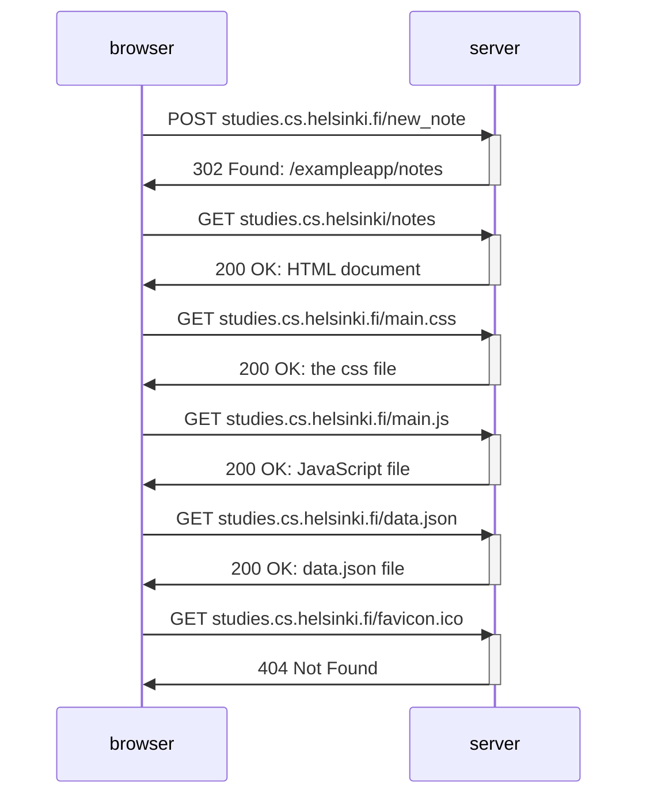

```mermaid
sequenceDiagram
participant browser
participant server
browser->>server: POST studies.cs.helsinki.fi/new_note
activate server
server->>browser: 302 Found: /exampleapp/notes
deactivate server
browser->>server: GET studies.cs.helsinki/notes
activate server
server->>browser: 200 OK: HTML document
deactivate server
browser->>server: GET studies.cs.helsinki.fi/main.css
activate server
server->>browser: 200 OK: the css file
deactivate server
browser->>server: GET studies.cs.helsinki.fi/main.js
activate server
server->>browser: 200 OK: JavaScript file
deactivate server
browser->>server: GET studies.cs.helsinki.fi/data.json
activate server
server->>browser: 200 OK: data.json file
deactivate server
browser->>server: GET studies.cs.helsinki.fi/favicon.ico
activate server
server->>browser: 404 Not Found
deactivate server

```