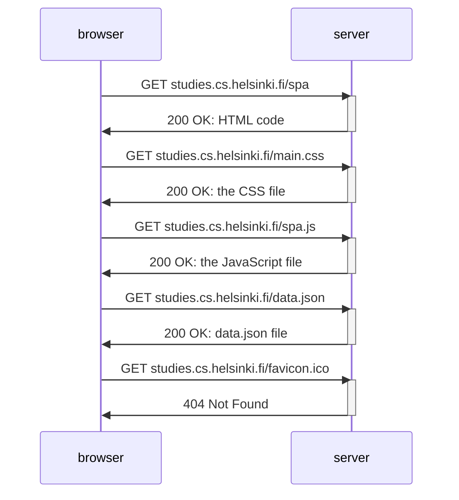

```mermaid
sequenceDiagram
participant browser
participant server
browser->>server: GET studies.cs.helsinki.fi/spa
activate server
server->>browser: 200 OK: HTML code
deactivate server
browser->>server: GET studies.cs.helsinki.fi/main.css
activate server
server->>browser: 200 OK: the CSS file
deactivate server
browser->>server: GET studies.cs.helsinki.fi/spa.js
activate server
server->>browser: 200 OK: the JavaScript file
deactivate server
browser->>server: GET studies.cs.helsinki.fi/data.json
activate server
server->>browser: 200 OK: data.json file
deactivate server
browser->>server: GET studies.cs.helsinki.fi/favicon.ico
activate server
server->>browser: 404 Not Found
deactivate server

```